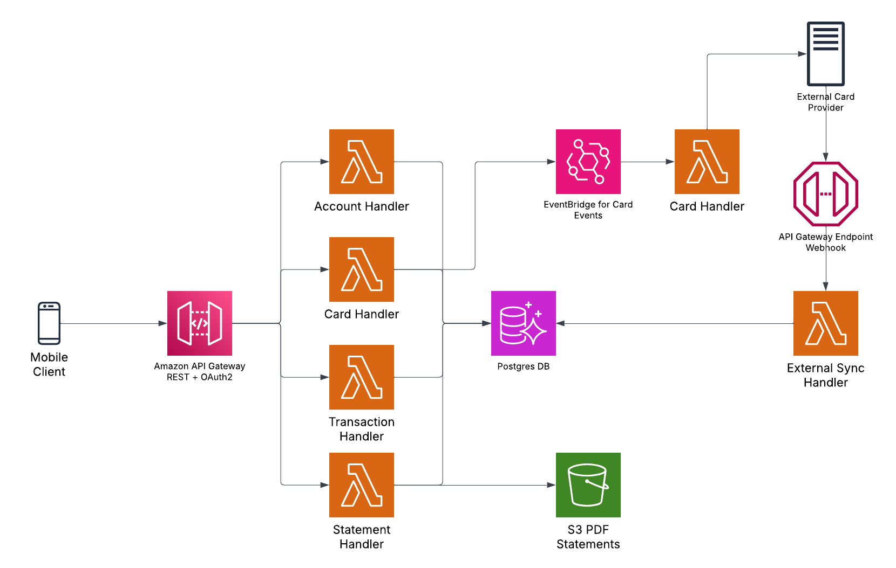
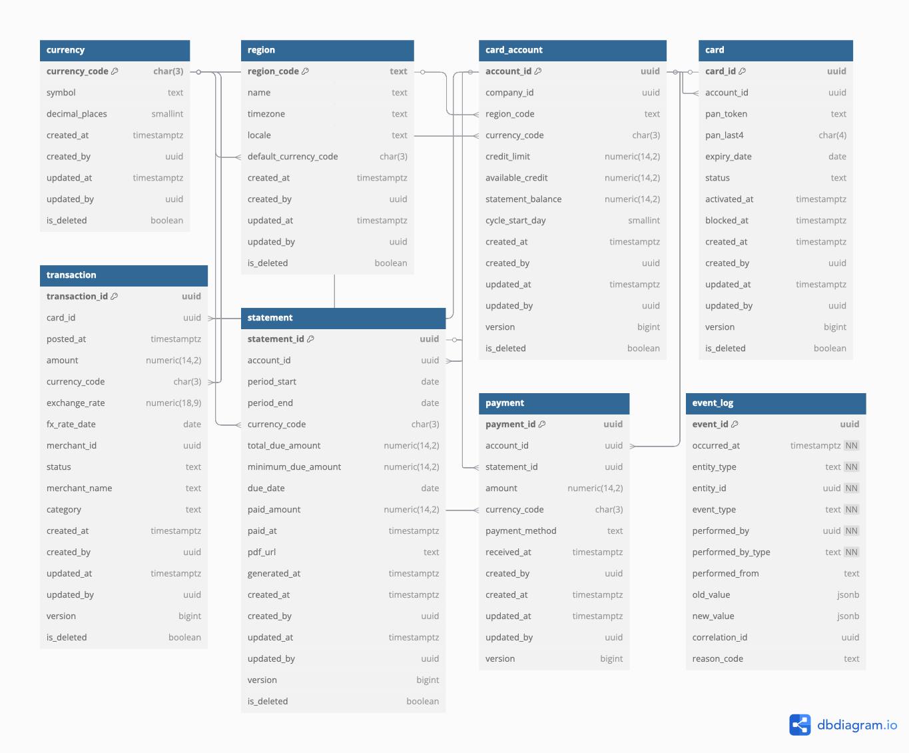

# Credit Card Service Architecture

This document provides a high‑level view of the Credit Card API’s design and data model as part of the Qred's case study. It’s intended for technical engineers to understand how the service is structured, what endpoints it exposes, and how the underlying data is organized.

## Architecture Diagram

## API Endpoints

| Resource Group                    | Method | Path                                                      | Description                                               | Authentication                   | Response DTO         |
| --------------------------------- | ------ | --------------------------------------------------------- | --------------------------------------------------------- | -------------------------------- | -------------------- |
| **Accounts**                      | GET    | `/cards/v1/accounts`                                      | List all credit accounts accessible by caller             | OAuth scope: `read:accounts`     | `AccountSummaryDTO`  |
| **Accounts**                      | GET    | `/cards/v1/accounts/{accountId}`                          | Retrieve detailed account by ID                           | OAuth scope: `read:accounts`     | `AccountDetailDTO`   |
| **Cards**                         | GET    | `/cards/v1/accounts/{accountId}/cards`                    | List all cards for the specified account                  | OAuth scope: `read:cards`        | `CardDetailDTO[]`    |
| **Cards**                         | PATCH  | `/cards/v1/cards/{cardId}`                                | Activate, block, unblock or update card settings          | OAuth scope: `write:cards`       | `CardDetailDTO`      |
| **Transactions**                  | GET    | `/cards/v1/cards/{cardId}/transactions`                   | Cursor‑paginated list of transactions for a card          | OAuth scope: `read:transactions` | `TransactionPageDTO` |
| **Statements**                    | GET    | `/cards/v1/accounts/{accountId}/statements`               | List all billing statements for an account                | OAuth scope: `read:statements`   | `StatementListDTO`   |
| **Statements**                    | GET    | `/cards/v1/accounts/{accountId}/statements/{periodStart}` | Retrieve a single statement (includes PDF URL)            | OAuth scope: `read:statements`   | `StatementDetailDTO` |
| **Integration** (Not implemented) | POST   | `/cards/v1/integration/card-updates`                      | Ingest card data updates from external provider (webhook) | HMAC signature or OAuth          | `204 No Content`     |

## Database Schema

### Table: Currency

| Column         | Type        | Constraints             | Description                  |
| -------------- | ----------- | ----------------------- | ---------------------------- |
| currency_code  | CHAR(3)     | PRIMARY KEY             | ISO‑4217 currency code       |
| symbol         | TEXT        | NOT NULL                | Currency symbol (e.g. “SEK”) |
| decimal_places | SMALLINT    | NOT NULL                | Number of decimal digits     |
| created_at     | TIMESTAMPTZ | NOT NULL, DEFAULT now() | Row creation timestamp       |
| created_by     | UUID        | NOT NULL                | Creator user/service ID      |
| updated_at     | TIMESTAMPTZ | NOT NULL, DEFAULT now() | Last update timestamp        |
| updated_by     | UUID        |                         | Updater user/service ID      |
| is_deleted     | BOOLEAN     | NOT NULL, DEFAULT FALSE | Soft‑delete flag             |

### Table: Region

| Column                | Type        | Constraints                        | Description                    |
| --------------------- | ----------- | ---------------------------------- | ------------------------------ |
| region_code           | TEXT        | PRIMARY KEY                        | Region identifier (e.g., “SE”) |
| name                  | TEXT        | NOT NULL                           | Human‑readable region name     |
| timezone              | TEXT        | NOT NULL                           | Default timezone (IANA)        |
| locale                | TEXT        | NOT NULL                           | Default locale (e.g., “sv_SE”) |
| default_currency_code | CHAR(3)     | REFERENCES currency(currency_code) | Default currency for region    |
| created_at            | TIMESTAMPTZ | NOT NULL, DEFAULT now()            | Creation timestamp             |
| created_by            | UUID        | NOT NULL                           | Creator ID                     |
| updated_at            | TIMESTAMPTZ | NOT NULL, DEFAULT now()            | Last update timestamp          |
| updated_by            | UUID        |                                    | Updater ID                     |
| is_deleted            | BOOLEAN     | NOT NULL, DEFAULT FALSE            |

### Table: Card Account

| Column            | Type          | Constraints                                       | Description                |
| ----------------- | ------------- | ------------------------------------------------- | -------------------------- |
| account_id        | UUID          | PRIMARY KEY, DEFAULT gen_random_uuid()            | Unique account identifier  |
| company_id        | UUID          | NOT NULL                                          | External company reference |
| region_code       | TEXT          | NOT NULL, REFERENCES region(region_code)          | Region of account          |
| currency_code     | CHAR(3)       | NOT NULL, REFERENCES currency(currency_code)      | Account currency           |
| credit_limit      | NUMERIC(14,2) | NOT NULL, CHECK(available_credit <= credit_limit) | Maximum credit             |
| available_credit  | NUMERIC(14,2) | NOT NULL                                          | Remaining credit           |
| statement_balance | NUMERIC(14,2) | NOT NULL                                          | Current balance            |
| cycle_start_day   | SMALLINT      | NOT NULL, CHECK(cycle_start_day BETWEEN 1 AND 28) | Billing cycle start day    |
| created_at        | TIMESTAMPTZ   | NOT NULL, DEFAULT now()                           | Creation timestamp         |
| created_by        | UUID          | NOT NULL                                          | Creator ID                 |
| updated_at        | TIMESTAMPTZ   | NOT NULL, DEFAULT now()                           | Last update timestamp      |
| updated_by        | UUID          |                                                   | Updater ID                 |
| version           | BIGINT        | NOT NULL, DEFAULT 1                               | Optimistic lock version    |
| is_deleted        | BOOLEAN       | NOT NULL, DEFAULT FALSE                           | Soft‑delete flag           |

### Table: Card

| Column       | Type        | Constraints                                   | Description                         |
| ------------ | ----------- | --------------------------------------------- | ----------------------------------- |
| card_id      | UUID        | PRIMARY KEY, DEFAULT gen_random_uuid()        | Unique card identifier              |
| account_id   | UUID        | NOT NULL, REFERENCES card_account(account_id) | Parent account                      |
| pan_token    | TEXT        | UNIQUE, NOT NULL                              | Tokenized PAN                       |
| pan_last4    | CHAR(4)     |                                               | Last four digits of PAN             |
| expiry_date  | DATE        | NOT NULL                                      | Card expiration date                |
| status       | TEXT        | NOT NULL                                      | Card status (active, blocked, etc.) |
| activated_at | TIMESTAMPTZ |                                               | Activation timestamp                |
| blocked_at   | TIMESTAMPTZ |                                               | Block timestamp                     |
| created_at   | TIMESTAMPTZ | NOT NULL, DEFAULT now()                       | Creation timestamp                  |
| created_by   | UUID        | NOT NULL                                      | Creator ID                          |
| updated_at   | TIMESTAMPTZ | NOT NULL, DEFAULT now()                       | Last update timestamp               |
| updated_by   | UUID        |                                               | Updater ID                          |
| version      | BIGINT      | NOT NULL, DEFAULT 1                           | Optimistic lock version             |
| is_deleted   | BOOLEAN     | NOT NULL, DEFAULT FALSE                       | Soft‑delete flag                    |

### Table: Transaction

| Column         | Type          | Constraints                                  | Description                   |
| -------------- | ------------- | -------------------------------------------- | ----------------------------- |
| transaction_id | UUID          | PRIMARY KEY, DEFAULT gen_random_uuid()       | Unique transaction identifier |
| card_id        | UUID          | NOT NULL, REFERENCES card(card_id)           | Parent card                   |
| posted_at      | TIMESTAMPTZ   | NOT NULL                                     | Posting timestamp             |
| amount         | NUMERIC(14,2) | NOT NULL                                     | Transaction amount            |
| currency_code  | CHAR(3)       | NOT NULL, REFERENCES currency(currency_code) | Transaction currency          |
| exchange_rate  | NUMERIC(18,9) | NOT NULL                                     | Exchange rate                 |
| fx_rate_date   | DATE          | NOT NULL                                     | Date of FX rate               |
| merchant_id    | UUID          |                                              | Merchant reference            |
| status         | TEXT          | NOT NULL, DEFAULT 'posted'                   | Transaction status            |
| merchant_name  | TEXT          |                                              | Merchant display name         |
| category       | TEXT          |                                              | Transaction category          |
| created_at     | TIMESTAMPTZ   | NOT NULL, DEFAULT now()                      | Creation timestamp            |
| created_by     | UUID          | NOT NULL                                     | Creator ID                    |
| updated_at     | TIMESTAMPTZ   | NOT NULL, DEFAULT now()                      | Last update timestamp         |
| updated_by     | UUID          |                                              | Updater ID                    |
| version        | BIGINT        | NOT NULL, DEFAULT 1                          | Optimistic lock version       |
| is_deleted     | BOOLEAN       | NOT NULL, DEFAULT FALSE                      | Soft‑delete flag              |

### Table: Statement

| Column             | Type          | Constraints                                   | Description                    |
| ------------------ | ------------- | --------------------------------------------- | ------------------------------ |
| statement_id       | UUID          | PRIMARY KEY, DEFAULT gen_random_uuid()        | Unique statement identifier    |
| account_id         | UUID          | NOT NULL, REFERENCES card_account(account_id) | Parent account                 |
| period_start       | DATE          | NOT NULL                                      | Statement period start         |
| period_end         | DATE          | NOT NULL                                      | Statement period end           |
| currency_code      | CHAR(3)       | NOT NULL, REFERENCES currency(currency_code)  | Statement currency             |
| total_due_amount   | NUMERIC(14,2) | NOT NULL, DEFAULT 0                           | Full statement balance         |
| minimum_due_amount | NUMERIC(14,2) | NOT NULL, DEFAULT 0                           | Minimum payment due            |
| due_date           | DATE          | NOT NULL                                      | Payment due date               |
| paid_amount        | NUMERIC(14,2) | NOT NULL, DEFAULT 0                           | Amount paid so far             |
| paid_at            | TIMESTAMPTZ   |                                               | Timestamp when fully paid      |
| pdf_url            | TEXT          |                                               | URL to statement PDF           |
| generated_at       | TIMESTAMPTZ   | NOT NULL, DEFAULT now()                       | Statement generation timestamp |
| created_at         | TIMESTAMPTZ   | NOT NULL, DEFAULT now()                       | Creation timestamp             |
| created_by         | UUID          | NOT NULL                                      | Creator ID                     |
| updated_at         | TIMESTAMPTZ   | NOT NULL, DEFAULT now()                       | Last update timestamp          |
| updated_by         | UUID          |                                               | Updater ID                     |
| version            | BIGINT        | NOT NULL, DEFAULT 1                           | Optimistic lock version        |
| is_deleted         | BOOLEAN       | NOT NULL, DEFAULT FALSE                       | Soft‑delete flag               |

### Table: Payment

| Column         | Type          | Constraints                                   | Description                  |
| -------------- | ------------- | --------------------------------------------- | ---------------------------- |
| payment_id     | UUID          | PRIMARY KEY, DEFAULT gen_random_uuid()        | Unique payment identifier    |
| account_id     | UUID          | NOT NULL, REFERENCES card_account(account_id) | Parent account               |
| statement_id   | UUID          | NOT NULL, REFERENCES statement(statement_id)  | Parent statement             |
| amount         | NUMERIC(14,2) | NOT NULL                                      | Payment amount               |
| currency_code  | CHAR(3)       | NOT NULL, REFERENCES currency(currency_code)  | Payment currency             |
| payment_method | TEXT          | NOT NULL                                      | Method (bank_transfer, etc.) |
| received_at    | TIMESTAMPTZ   | NOT NULL, DEFAULT now()                       | Payment receipt timestamp    |
| created_by     | UUID          | NOT NULL                                      | Creator ID                   |
| created_at     | TIMESTAMPTZ   | NOT NULL, DEFAULT now()                       | Creation timestamp           |
| updated_at     | TIMESTAMPTZ   | NOT NULL, DEFAULT now()                       | Last update timestamp        |
| updated_by     | UUID          |                                               | Updater ID                   |
| version        | BIGINT        | NOT NULL, DEFAULT 1                           | Optimistic lock version      |

### Table: Event Log

| Column         | Type        | Constraints                            | Description                                        |
| -------------- | ----------- | -------------------------------------- | -------------------------------------------------- |
| event_id       | UUID        | PRIMARY KEY, DEFAULT gen_random_uuid() | Unique identifier for this audit record            |
| occurred_at    | TIMESTAMPTZ | NOT NULL, DEFAULT now()                | When the event occurred                            |
| entity_type    | TEXT        | NOT NULL                               | Domain object type (e.g. card, payment, statement) |
| entity_id      | UUID        | NOT NULL                               | Identifier of the affected resource                |
| event_type     | TEXT        | NOT NULL                               | Specific action (e.g. card_status_updated)         |
| performed_by   | UUID        | NOT NULL                               | ID of the user or service that initiated the event |
| performed_from | TEXT        |                                        | Origin IP or service name                          |
| reason_code    | TEXT        |                                        | Business reason or ticket ID for change            |
| old_value      | JSONB       |                                        | Pre‑change snapshot of the resource                |
| new_value      | JSONB       |                                        | Post‑change snapshot of the resource               |
| correlation_id | UUID        |                                        | Trace identifier to correlate related events       |
